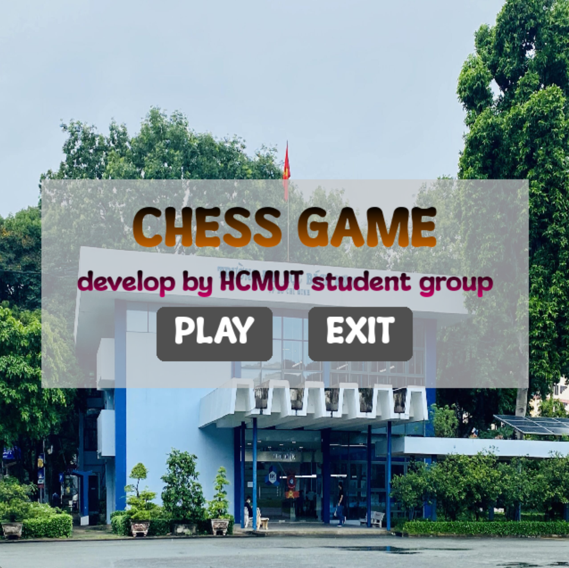
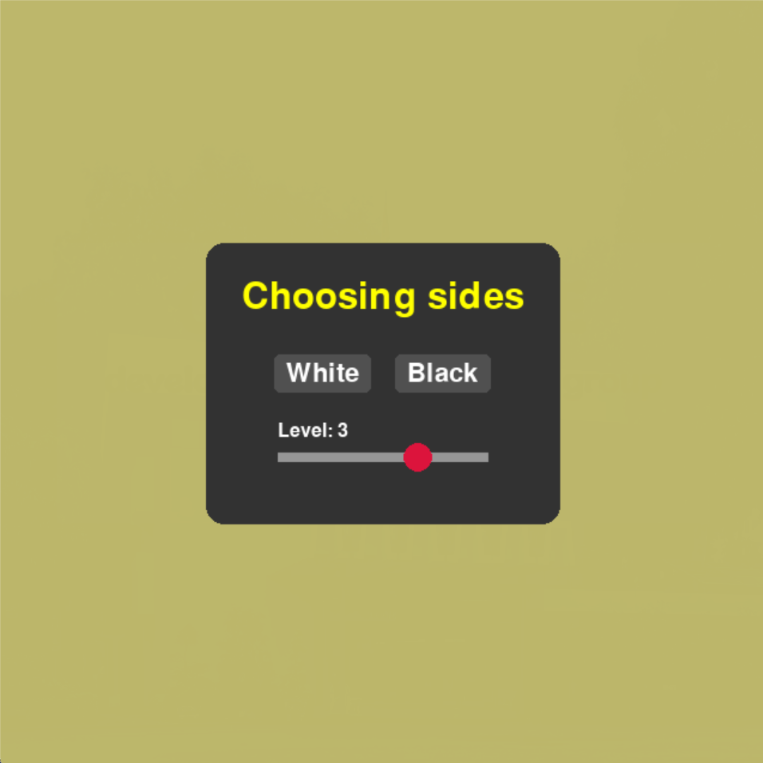
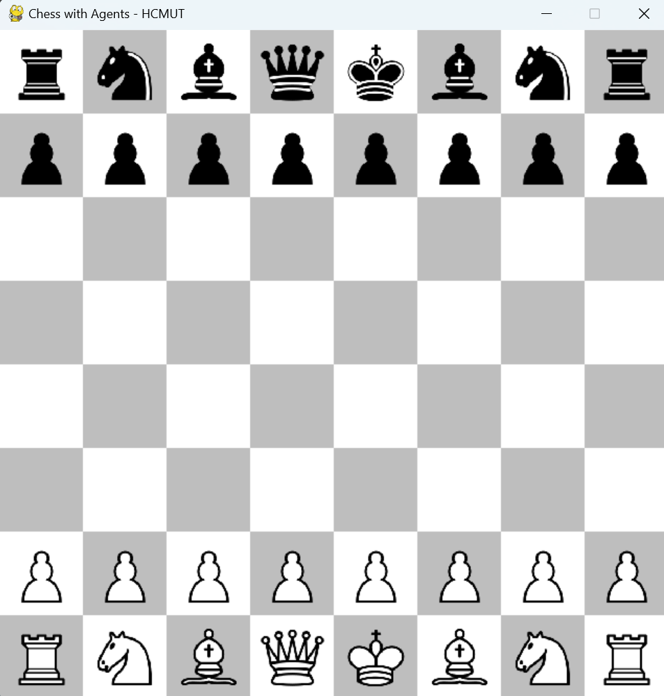
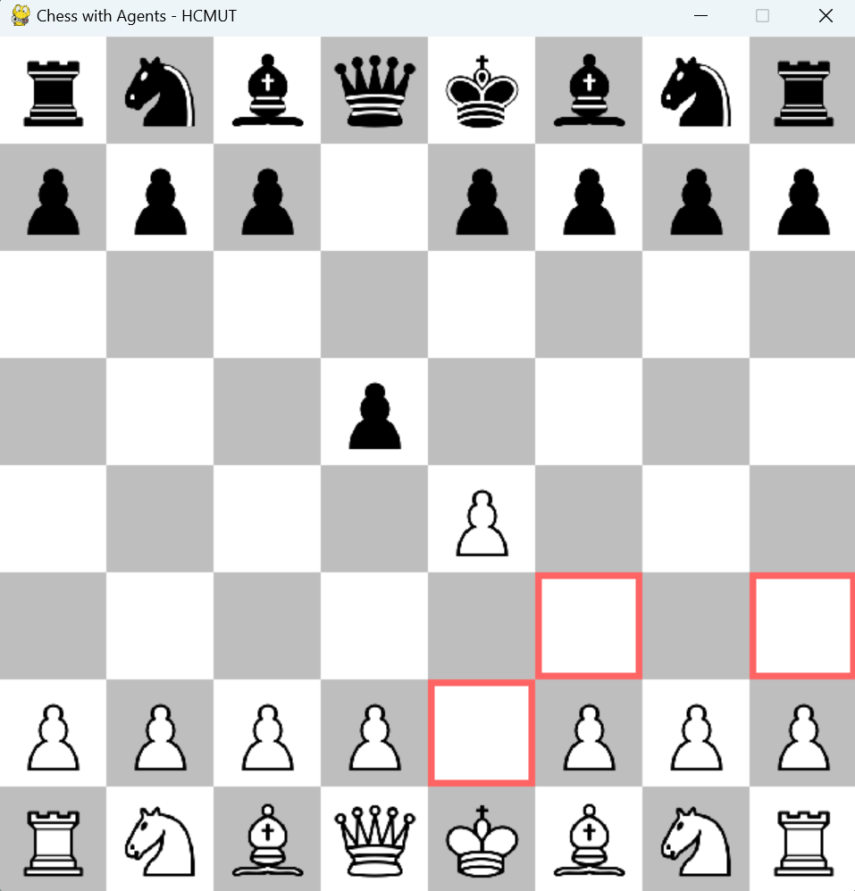
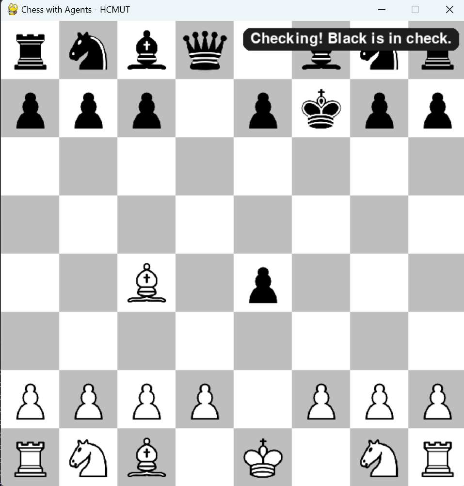
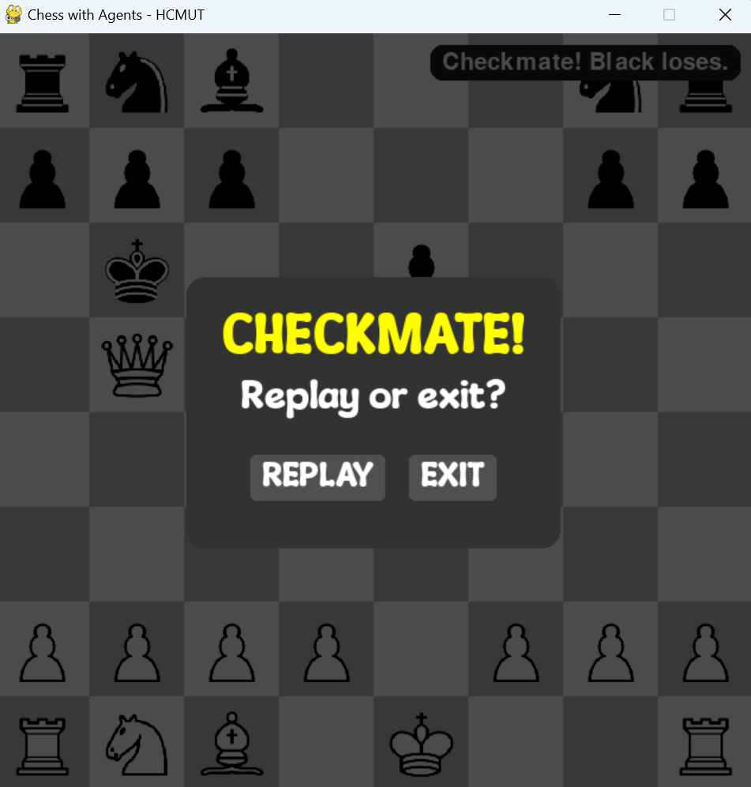
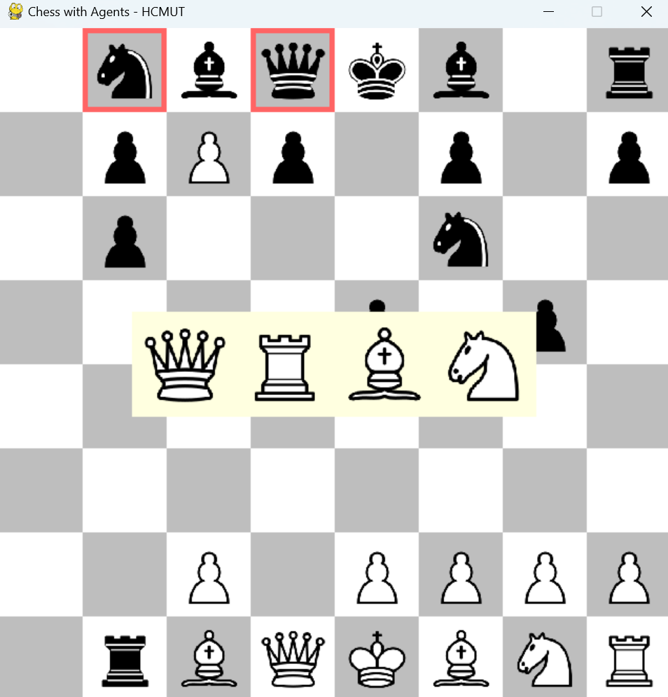
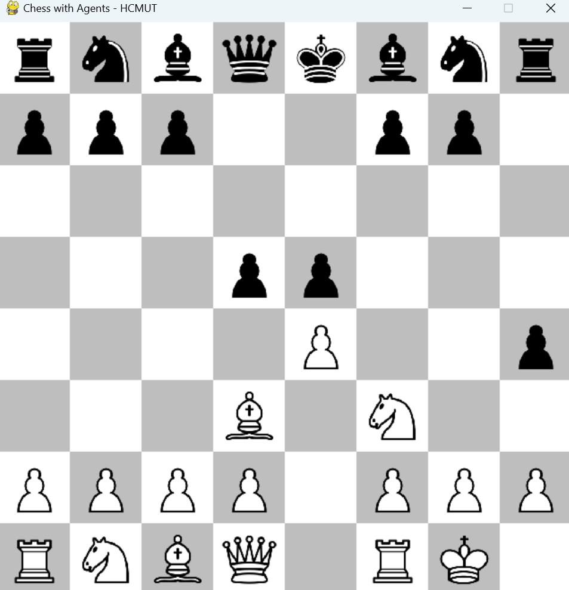

<p align="center">
  
</p>

<h1 align="center">CHESS GAME</h1>

<p align="center">
  Final Project – Introduction to Artificial Intelligence (CO3061)<br>
  Semester: 242
</p>

## Contributors

- **Trần Quang Huy** – 2211287  
- **Trần Dương Quốc Anh** – 2210134

## Overview

In this project, we have developed a chess game application that allows players to compete against agents with different difficulty levels.  
The rules follow the official FIDE Laws of Chess:  🔗 https://www.fide.com/FIDE/handbook/LawsOfChess.pdf

## Installation
Before running the application, install all required libraries using:

``` bash
pip install -r requirements.txt
```

## How to Play
To start the game, run the main script:
``` bash
python main.py
```
The game interface will appear as follows:
<p align="center">
  
  <br>
  <em>Dashboard</em>
</p>


From the Main Menu, click Play to select your side (Black/White) and the agent difficulty level.
There are 4 levels available, from easiest to hardest:
<p align="center">
  
  <br>
  <em>Side Page</em>
</p>


Once a level is selected, the game begins. Here are some example screenshots from gameplay:
<p align="center">
  
  <br>
  <em>Initial board</em>
</p>

<p align="center">
  
  <br>
  <em>Legal moves</em>
</p>

<p align="center">
  
  <br>
  <em>Checking</em>
</p>

<p align="center">
  
  <br>
  <em>Checkmate</em>
</p>

<p align="center">
  
  <br>
  <em>Promotion</em>
</p>
<p align="center">
  
  <br>
  <em>Castling</em>
</p>

## Bot vs Bot
To simulate a match between two AI agents, run:
``` bash
python fight.py
```
By default, this script pits a Level 3 Agent against a Mini Agent, and the results will be printed in the command line.

For a broader evaluation, please refer to the `result/` folder. It contains outcomes of 50 matches for each level against random agents. We also provide a plot showing the relation between number of moves and game number, implemented in `plot.py`.

## Feedback
We welcome all feedback and suggestions for improving future versions of the project.

— **Development Team**
